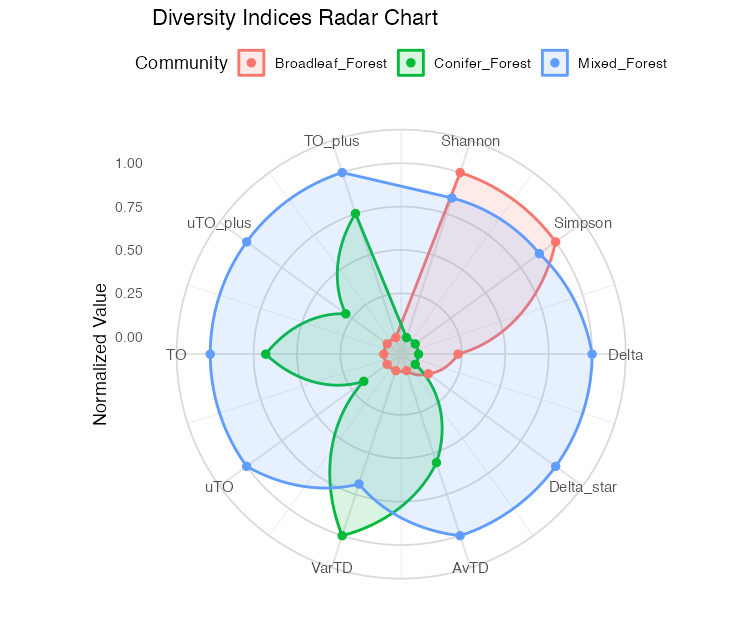
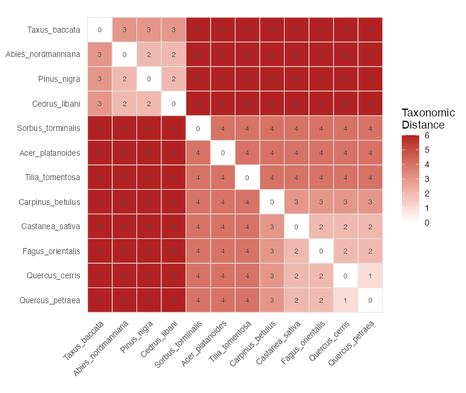
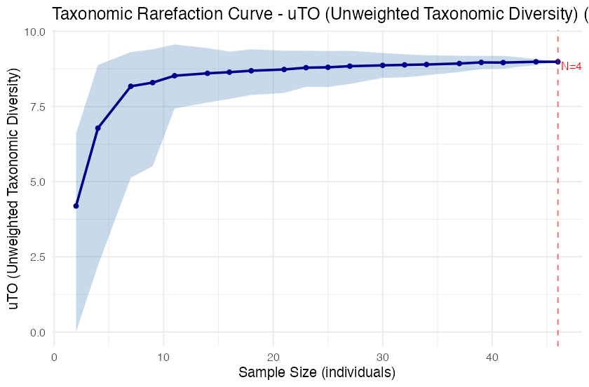
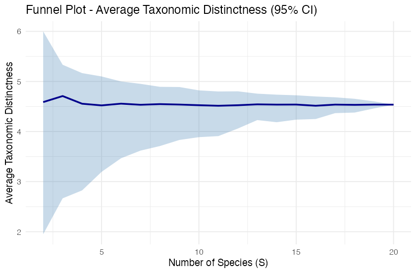
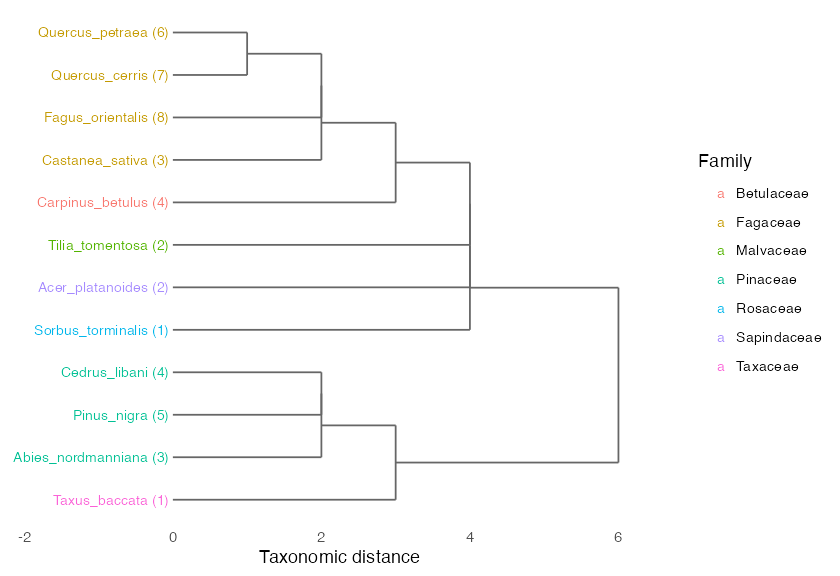
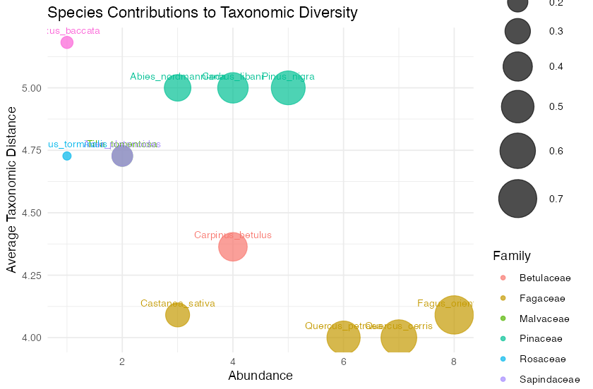

<h1 align="center">taxdiv</h1>

<p align="center">
  <b>Taxonomic diversity indices for ecological community data — in one place.</b><br>
  Classical measures, Clarke &amp; Warwick distinctness, and the Deng entropy-based
  Ozkan (2018) method, with an interactive dashboard and publication-ready graphics.
</p>

<p align="center">
  <a href="https://CRAN.R-project.org/package=taxdiv"></a>
  <a href="https://CRAN.R-project.org/package=taxdiv"></a>
  <a href="https://github.com/mgorgoz/taxonomic-diversity-r/actions/workflows/R-CMD-check.yaml"></a>
  <a href="https://app.codecov.io/gh/mgorgoz/taxonomic-diversity-r"></a>
  <a href="https://lifecycle.r-lib.org/articles/stages.html#stable"></a>
  
  <a href="https://opensource.org/licenses/MIT"></a>
</p>

---

Traditional indices such as Shannon and Simpson treat every species as equally
distinct. But 10 species from 10 different families are taxonomically more diverse
than 10 species from a single genus. **taxdiv** captures this by folding the
taxonomic hierarchy into the calculation — through two complementary frameworks
(**Clarke &amp; Warwick** distinctness and **Ozkan pTO** based on Deng entropy) — and
ships everything from raw Excel data to finished figures.

## 🖥️ Interactive Dashboard

No code required. `taxdiv_explorer()` launches a point-and-click Shiny app: load an
Excel/CSV file, pick which index families to compute, run the analysis with a live
progress bar, explore five graph types, and download results and figures.

```r
library(taxdiv)
taxdiv_explorer()
```

<p align="center">
  
</p>

## ⚡ Installation

```r
# From CRAN
install.packages("taxdiv")

# Development version from GitHub
# install.packages("devtools")
devtools::install_github("mgorgoz/taxonomic-diversity-r")
```

## 🚀 Quick Start

```r
library(taxdiv)

# Species abundances
community <- c(
  Quercus_robur      = 15,
  Pinus_nigra        = 8,
  Fagus_orientalis   = 12,
  Abies_nordmanniana = 5,
  Juniperus_excelsa  = 3
)

# Taxonomic hierarchy
tax_tree <- build_tax_tree(
  species = names(community),
  Genus   = c("Quercus", "Pinus", "Fagus", "Abies", "Juniperus"),
  Family  = c("Fagaceae", "Pinaceae", "Fagaceae", "Pinaceae", "Cupressaceae"),
  Order   = c("Fagales", "Pinales", "Fagales", "Pinales", "Pinales")
)

compare_indices(community, tax_tree)  # all 14 indices at once
ozkan_pto(community, tax_tree)        # the 8 Ozkan pTO values
```

**From Excel — one command, all sites, automatic column detection:**

```r
data <- as.data.frame(readxl::read_excel("my_data.xlsx"))
batch_analysis(data)
#>   Site N_Species Shannon Simpson Delta Delta_star  AvTD VarTD  uTO   TO ...
#>   A1           6   1.494   0.757 1.622      2.138 2.333 0.667 2.14 3.49 ...
#>   A2           5   1.577   0.784 1.719      2.243 2.500 0.500 1.98 3.21 ...
```

A ready-to-use Excel template ships with the package:
[`taxdiv_data_template.xlsx`](inst/templates/taxdiv_data_template.xlsx).

## 📊 Gallery

Seven ggplot2-based plot types. A few examples on the bundled `anatolian_trees` data:

<table>
  <tr>
    <td width="50%"></td>
    <td width="50%"></td>
  </tr>
  <tr>
    <td align="center"><b>Radar</b> — compare every index across sites</td>
    <td align="center"><b>Heatmap</b> — pairwise taxonomic distance</td>
  </tr>
  <tr>
    <td width="50%"></td>
    <td width="50%"></td>
  </tr>
  <tr>
    <td align="center"><b>Rarefaction</b> — bootstrap curves for 8 indices</td>
    <td align="center"><b>Funnel</b> — 95% significance envelope (AvTD/VarTD)</td>
  </tr>
  <tr>
    <td width="50%"></td>
    <td width="50%"></td>
  </tr>
  <tr>
    <td align="center"><b>Dendrogram</b> — taxonomic hierarchy</td>
    <td align="center"><b>Bubble</b> — species contributions</td>
  </tr>
</table>

## ✨ Why taxdiv?

| Feature | vegan | ape | **taxdiv** |
|---------|:-----:|:---:|:----------:|
| Shannon / Simpson | yes | — | yes |
| Clarke &amp; Warwick suite (Delta, Delta\*, AvTD, VarTD) | — | partial | **yes** |
| Ozkan pTO — 8 indices (Run 1+2+3) | — | — | **yes** |
| Simulation-based significance (funnel plots) | — | — | **yes** |
| Taxonomic rarefaction with bootstrap CI | — | — | **yes** |
| Stochastic resampling + sensitivity analysis | — | — | **yes** |
| Bias-corrected Shannon (Miller-Madow, Grassberger, Chao-Shen) | — | — | **yes** |
| Excel → results in one command | — | — | **yes** |
| Interactive Shiny dashboard | — | — | **yes** |

## 🧰 Features

**26 exported functions** across the full workflow:

| Category | Functions |
|----------|-----------|
| **Classical** | `shannon()` (3 bias corrections), `simpson()` |
| **Clarke &amp; Warwick** | `delta()`, `delta_star()`, `avtd()`, `vartd()` |
| **Ozkan pTO** | `ozkan_pto()`, `pto_components()`, `deng_entropy_level()` |
| **Ozkan pipeline** | `ozkan_pto_full()`, `ozkan_pto_resample()`, `ozkan_pto_sensitivity()`, `ozkan_pto_jackknife()` |
| **Batch / compare** | `batch_analysis()`, `compare_indices()` |
| **Simulation / rarefaction** | `simulate_td()`, `rarefaction_taxonomic()` |
| **Structure** | `build_tax_tree()`, `tax_distance_matrix()` |
| **Visualization** | `plot_funnel()`, `plot_rarefaction()`, `plot_iteration()`, `plot_radar()`, `plot_heatmap()`, `plot_bubble()`, `plot_taxonomic_tree()` |
| **Dashboard** | `taxdiv_explorer()` |

Every main result object has tidy `print()` and `summary()` methods (13 S3 methods
total), and the three example datasets (`anatolian_trees`, `gazi_comm`, `gazi_gytk`)
let you try everything immediately.

## 🔁 Excel macro equivalence

taxdiv reproduces the 8 Ozkan pTO values from the original Excel macro, with full
reproducibility via a `seed` argument:

| Excel macro | taxdiv |
|-------------|--------|
| Run 1 — uT0+, T0+ | `uTO_plus`, `TO_plus` |
| Run 2 — uT0, T0 | `uTO`, `TO` |
| Run 3 — uT0+max, T0+max, uT0max, T0max | `uTO_plus_max`, `TO_plus_max`, `uTO_max`, `TO_max` |

The `_max` variants use only informative taxonomic levels (where Deng entropy > 0),
matching the macro's Run 3 behaviour.

## 📚 Learn more

Full documentation, tutorials, and the method theory live on the package website:

- **[Get Started](https://mgorgoz.github.io/taxonomic-diversity-r/articles/introduction.html)** — a guided tour
- **[Complete Workflow](https://mgorgoz.github.io/taxonomic-diversity-r/articles/workflow.html)**
- **[Ozkan pTO Method](https://mgorgoz.github.io/taxonomic-diversity-r/articles/ozkan-pto.html)** — Deng entropy, the slicing procedure, and the 8 indices
- **[Clarke &amp; Warwick Distinctness](https://mgorgoz.github.io/taxonomic-diversity-r/articles/clarke-warwick.html)**
- **[Visualization Guide](https://mgorgoz.github.io/taxonomic-diversity-r/articles/visualization.html)**
- **[Türkçe Rehber](https://mgorgoz.github.io/taxonomic-diversity-r/articles/giris_rehberi.html)**

## 📦 Package status

| Metric | Value |
|--------|-------|
| R CMD check | 0 errors, 0 warnings, 0 notes |
| Unit tests | 668 passing |
| Exported functions | 26 |
| S3 methods | 13 |
| Example datasets | 3 |
| Vignettes | 7 (6 English + 1 Turkish) |

## 📖 Citation

```r
citation("taxdiv")
```

> Gorgoz MM, Ozkan K, Negiz MG (2026). *taxdiv: Taxonomic Diversity Indices Using
> Deng Entropy*. R package version 1.0.0.
> <https://github.com/mgorgoz/taxonomic-diversity-r>
>
> Ozkan K (2018). "A new proposed measure for estimating taxonomic diversity."
> *Turkish Journal of Forestry*, 19(4), 336–346. doi:10.18182/tjf.441061.

<details>
<summary><b>Full reference list</b></summary>

**Primary methods**

- Ozkan, K. (2018). A new proposed measure for estimating taxonomic diversity.
  *Turkish Journal of Forestry*, 19(4), 336–346.
  doi: [10.18182/tjf.441061](https://doi.org/10.18182/tjf.441061)
- Ozkan, K. &amp; Mert, A. (2022). Comparisons of Deng entropy-based taxonomic
  diversity measures with the other diversity measures and introduction to the new
  proposed (reinforced) estimators. *FORESTIST*, 72(2).
  doi: [10.5152/forestist.2021.21025](https://doi.org/10.5152/forestist.2021.21025)
- Deng, Y. (2016). Deng entropy. *Chaos, Solitons &amp; Fractals*, 91, 549–553.
  doi: [10.1016/j.chaos.2016.08.011](https://doi.org/10.1016/j.chaos.2016.08.011)

**Taxonomic distinctness**

- Warwick, R.M. &amp; Clarke, K.R. (1995). New 'biodiversity' measures reveal a
  decrease in taxonomic distinctness with increasing stress. *Marine Ecology Progress
  Series*, 129, 301–305. doi: [10.3354/meps129301](https://doi.org/10.3354/meps129301)
- Clarke, K.R. &amp; Warwick, R.M. (1998). A taxonomic distinctness index and its
  statistical properties. *Journal of Applied Ecology*, 35(4), 523–531.
  doi: [10.1046/j.1365-2664.1998.3540523.x](https://doi.org/10.1046/j.1365-2664.1998.3540523.x)
- Clarke, K.R. &amp; Warwick, R.M. (1999). The taxonomic distinctness measure of
  biodiversity: weighting of step lengths between hierarchical levels. *Marine Ecology
  Progress Series*, 184, 21–29. doi: [10.3354/meps184021](https://doi.org/10.3354/meps184021)
- Clarke, K.R. &amp; Warwick, R.M. (2001). A further biodiversity index applicable to
  species lists: variation in taxonomic distinctness. *Marine Ecology Progress Series*,
  216, 265–278. doi: [10.3354/meps216265](https://doi.org/10.3354/meps216265)

**Classical diversity**

- Shannon, C.E. (1948). A mathematical theory of communication. *Bell System Technical
  Journal*, 27(3), 379–423.
  doi: [10.1002/j.1538-7305.1948.tb01338.x](https://doi.org/10.1002/j.1538-7305.1948.tb01338.x)
- Simpson, E.H. (1949). Measurement of diversity. *Nature*, 163, 688.
  doi: [10.1038/163688a0](https://doi.org/10.1038/163688a0)

**Evidence theory &amp; bias correction**

- Dempster, A.P. (1967). Upper and lower probabilities induced by a multivalued
  mapping. *The Annals of Mathematical Statistics*, 38(2), 325–339.
  doi: [10.1214/aoms/1177698950](https://doi.org/10.1214/aoms/1177698950)
- Shafer, G. (1976). *A Mathematical Theory of Evidence*. Princeton University Press.
- Chao, A. &amp; Shen, T.-J. (2003). Nonparametric estimation of Shannon's index of
  diversity when there are unseen species in sample. *Environmental and Ecological
  Statistics*, 10, 429–443.
  doi: [10.1023/A:1026096204727](https://doi.org/10.1023/A:1026096204727)

</details>

## 🤝 Contributing

Contributions are welcome:

- [Report a bug](https://github.com/mgorgoz/taxonomic-diversity-r/issues/new?template=bug_report.md)
- [Request a feature](https://github.com/mgorgoz/taxonomic-diversity-r/issues/new?template=feature_request.md)
- [Ask a question](https://github.com/mgorgoz/taxonomic-diversity-r/discussions)

## 📄 License

MIT © Gorgoz MM, Ozkan K, Negiz MG, Mert A
